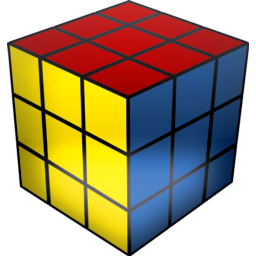

# GRCube3
C++ classes for 3x3x3 Rubik's cube.

The objective of this code is to search for algorithms that solve the cube, so that it is as fast as possible.

These classes can be easily integrated into other programs, they are cross-platform and only use standard C ++ libraries.

To understand this code you must be familiar with the [notation of the rubik's cube](https://ruwix.com/the-rubiks-cube/notation/).



# Solve a cube using CFOP method
```
#include "cfop.h" // CFOP method header

...

Algorithm Scramble(25); // Random scramble with 25 optimized movements	
CFOP SearchCFOP(Scramble); // Creates the search

// Crosses to search as pieces groups - we will search the best cross in all faces
std::vector<PiecesGroups> Crosses =
{
  PiecesGroups::C_U, // Four edges in up face
  PiecesGroups::C_D, // Four edges in down face
  PiecesGroups::C_F, // Four edges in front face
  PiecesGroups::C_B, // Four edges in back face
  PiecesGroups::C_R, // Four edges in right face
  PiecesGroups::C_L  // Four edges in left face
};

SearchCFOP.SearchCross(6, Crosses); // Search best cross in 6 movements or less
SearchCFOP.SearchF2L(); // Complete the search for the first two layers
SearchCFOP.SearchOLL(); // Search OLL algorithm
SearchCFOP.SearchPLL(); // Search PLL algorithm

std::cout << SearchCFOP.GetReport() << endl; // Get the search report
```

# How to use Cube and Algorithm classes (most important features)

## Creating a cube
```
#include "cube.h" // Cube header
#include "algorithm.h" // Algorithm header

Cube C1; // Creates a cube in solve condition

Algorithm A(25); // Creates an algorithm with 25 random movements - movements are optimized and can't be reduced
Cube C2(A); // Creates a cube with the given algorithm applyed
```

## Set a cube to his solve condition (reset)
```
C2.Reset(); // Cube C2 is in his solve condition
```

## Comparing cubes
```
if (C1 == C2) { ... } // Check if two cubes are in the same condition
if (C1 != C2) { ... } // Check if two cubes are in the different condition
```

## Checking the cube status
```
if (C1.IsSolved()) { ... } // Check if the cube is in his solve condition
if (C1.IsSolved(Pieces::UFR) { ... } // Check if the piece UFR (Up, Front, Right) is in his solve position and has his correct direction
if (C1.IsSolved(Layers::F) { ... } // Check if all the pieces in front layer (F) are solved
```

## Making movements to the cube
```
C.U(); // Move the layer U 90 degrees in clock-wise direction
```
You can use U, U2, Up (as U'), D, D2, ... movements. Also x, x2, xp (as x'), y, y2, yp, z, z2 and zp turns are implemented.
```
Algorithm A("U F' R2 L D' F B' R2 D2 L"); // Creates an algorithm with the given movements
C.Reset(); // Cube to his solve condition
C.ApplyAlgorithm(A); // Apply the algorithm to the cube
```

## Getting cube status to draw it

You can get the face of the sticker in each position. As each face has his own color you can draw it.

```
Faces Face_UF_U = GetFace(StickerPositions::UF_U); // Get the face of the upper sticker in the up/front edge

Faces Face_DBL_B = GetFace(StickerPositions::DBL_B); // Get the face of the back sticker in the down/back/left corner
```

For example, if Face_UF_U == Faces::L, this sticker will be orange (usually the left face is that color).

# Check out the code for many more features!!!

Thanks for your interest.
